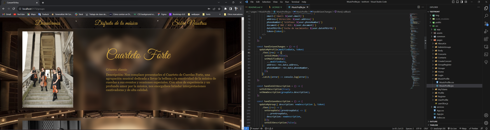
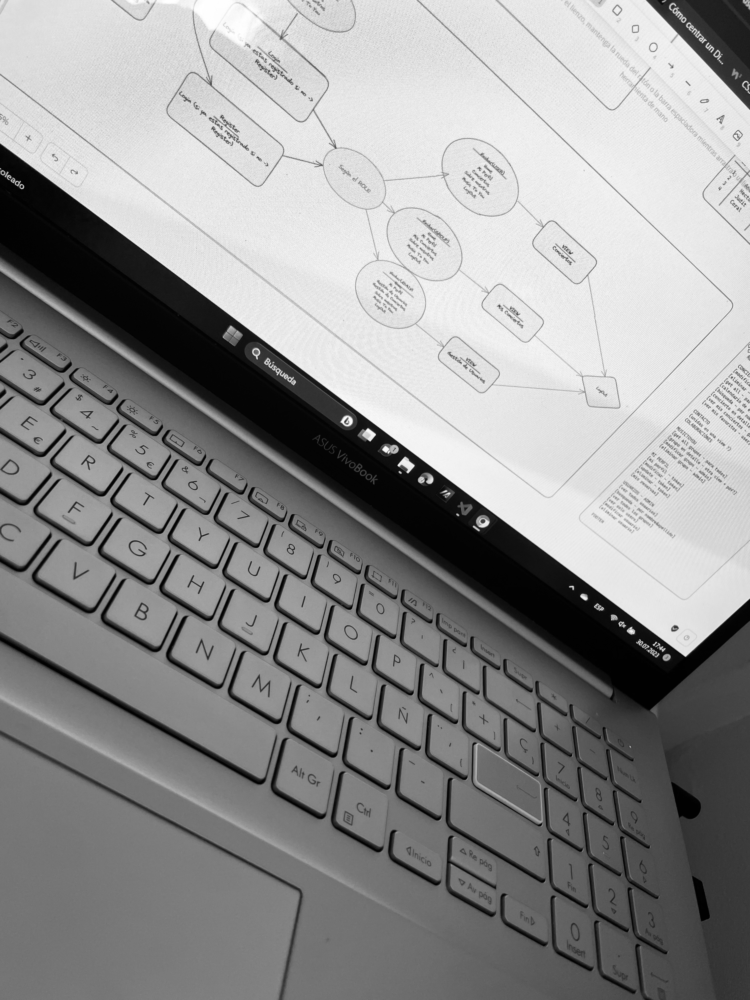

<h1 align="center">Welcome to my ConcertTiYou app</h1>

<h1 align="center">Final project in Geekshubs Academy FSD 04-2023</h1>



<details>
  <summary>Contet: 📝</summary>
  <ol>
    <li><a href="#target">Target</a></li>
    <li><a href="#about-the-project">About the project</a></li>
    <li><a href="#stack">Stack</a></li>
    <li><a href="#installation">Installation</a></li>
    <li><a href="#development ">Development</a></li>
    <li><a href="#endpoints">Endpoints</a></li>
    <li><a href="#future-functionalities">Future functionalities</a></li>
    <li><a href="#license">License</a></li>
    <li><a href="#acknowledgments">Acknowledgments</a></li>
    <li><a href="#contacts">Contacts</a></li>
  </ol>
</details>

## Target
The purpose of this project was to develop a SPA (single page application) on any topic, using React technology. In my case I chose a theme close to me. The challenge was: to create several components using React hooks. Maintain a well-organized folder structure, such as "components" and "containers", to keep the code clean and modularized.
In a short:
Create views that interact with the endpoints of a previously created API, allowing the user to interact with the information provided by the API.
In summary, the goal is for the student to build a SPA with React that is functional, aesthetically pleasing and can handle both internal and external data through an API.

## About the project
<p aling="center"></p>
I have decided to choose this topic, not only because it is very close to me, but also because I see the necessity in real life when it is about young musicians who are finishing their career, or newly formed (local) bands that are trying to promote their concerts and it is not as easy as it seems. With this platform the idea is to help the musicians to promote and manage their concerts, band data and for the users to be able to manage the tickets, see which bands are on our platform, get to know them more closely and help to keep track of their concerts and programs.

## Stack
<div align="center">
<a href="https://www.reactjs.com/">
    
</a>
 <a href="https://redux.js.org/">
    
</a>
<a href="https://nodejs.org/en">
    
</a>
<a href="https://react-bootstrap.github.io/">
    
</a>
<a href="https://developer.mozilla.org/es/docs/Web/CSS">
    
</a>
<a href="https://nextjs.org/">
    
</a>

 
</div>

## Installation

you can test the application by following these steps:
 Clone the project on your computer
    ` $ git clone 'url-repository' `
 Install all dependencies
    ` $ npm install `
 Create a .env with the credentials on the .env.example
 Start server with:
   ``` $ npm run dev ```
 Connect with the database following:
    ``` $ npx sequelize-cli db:create ```
    ``` $ npx sequelize-cli db:migrate ```
    ``` $ npx sequelize-cli db:seed:all ```
Now is time for frontend project:
 Clone the project on your computer
    ` $ git clone 'url-repository' `
 Install all dependencies
    ` $ npm i `
 Start server with:
   ``` $ npm run dev ```
Last step download the dataBase:
[Data base Git-Hub](https://github.com/AnastasiaKosovets/ak-fsd-backend-dentalClinic)

## Development 

To start the project, I first had to define the general design and structure of the application. Since the backend was already done, creating the views for the frontend was simpler and more intuitive. I listed all the functionalities and actions to be performed by my application, based on the API endpoints created earlier. Then, I precisely calculated the time needed to implement each function.




## Endpoints

#### Currently the following actions can be performed in this app:
- Login
- Register
- Logout
- Home view
- About Us
- Concerts
- Groups
- Contacts
### User:
- My Profile 
- Access to personalize your personal data (from My Profile)
- Delete Profile
- Get my tickets
- Book ticket
- Add to favorites
- Get my favorites
- Register my group
### Musician:
- Get my group
- Update some information of my group
- Get my concerts
- Update(some information) of my concert
- Public concert
### Admin:
- Search user by name & surname
- Update profile
- Get all users
- Delete & restore user
- Delete & restore group
- Delete & restore concert
- Update some information of group
- Update some information of concert


## Future functionalities

As future features I would like to develop the user interface in more depth, having more options for managing personal data, in addition to the collaborations and to be able to introduce real sale of tickets, are some examples of the general idea. 

## License
This project is belonging to license Creative Commons Legal Code. That's right, all the images I have used in this final project come from public resources and are freely available for use. Furthermore, I want to emphasize that I have only used them for educational purposes within the context of this project. They have not been used for any commercial purpose or with intent to infringe copyright.
 

## Acknowledgments:

I thank my teachers for their time dedicated to this project:

- ***Dani***  
<a href="https://github.com/Datata" target="_blank"></a> 

- ***Jose***  
<a href="https://www.github.com/JoseMarin" target="_blank"></a>

- ***David***  
<a href="https://www.github.com/Dave86dev" target="_blank"></a>

- ***Mara***  
<a href="https://www.github.com/MaraScampini" target="_blank"></a> 

## Contacts
#### ｛ Anastasia Kosovets  ｝
<a href = "mailto:anastasiakosovets@gmail.com"></a>
<a href="https://www.linkedin.com/in/anastasia-kosovets-00022917b/" target="_blank"></a> 
</p>